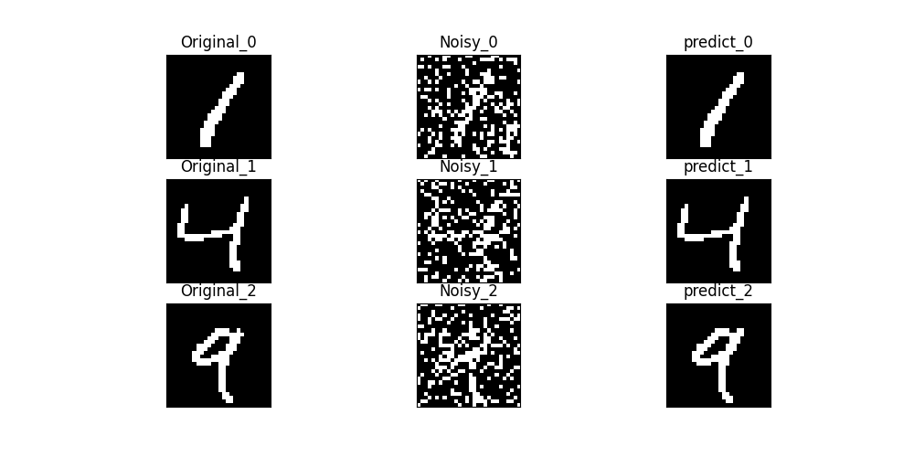
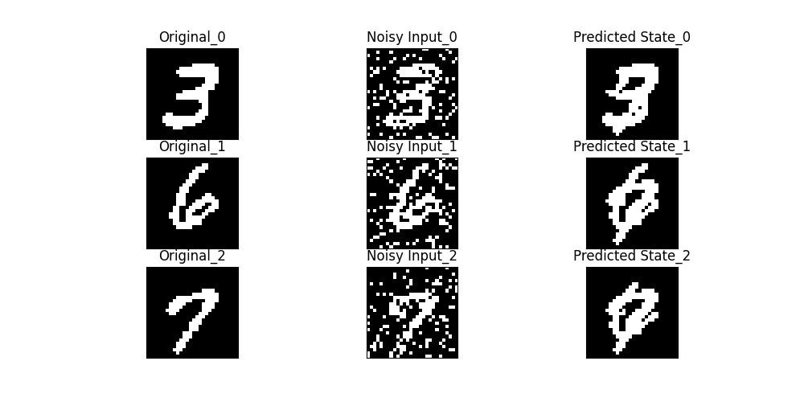
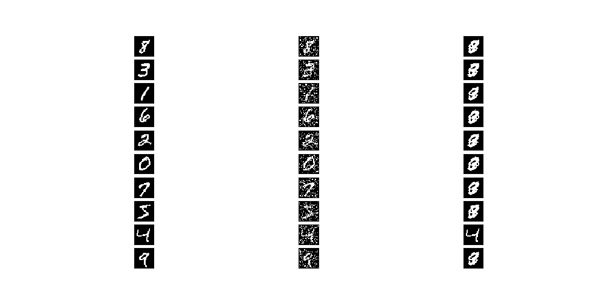

# Hopfield Neural Network for Associative Memory and Pattern Recognition

## Project Overview

This project implements a **Hopfield neural network** designed for associative memory tasks. Hopfield networks are recurrent neural networks known for their ability to store and retrieve patterns, particularly when those patterns are slightly noisy or incomplete. The network operates by iteratively adjusting its states to minimize an energy function, ultimately converging on a stable state representing the closest stored pattern. 

In this project, the Hopfield network is trained to store clean images of handwritten digits from the MNIST dataset, and it can successfully recall these patterns from noisy versions. This approach demonstrates the network’s use in associative memory and its capacity for pattern recognition and noise reduction.

## Use Cases

Hopfield networks, while specialized, have applications across various fields where pattern recognition and associative memory are relevant. Key use cases include:

1. **Image Denoising and Pattern Recognition**: Hopfield networks are effective in recognizing and restoring patterns with missing or noisy data, making them useful for image reconstruction tasks.
2. **Biological Modeling of Memory**: The dynamics of Hopfield networks are inspired by certain cognitive processes and have been used to model associative memory in neuroscience, particularly for understanding short-term memory functions.
3. **Error Correction in Data Transmission**: Their capability to converge on stored patterns despite noise makes Hopfield networks suitable for correcting small errors in transmitted data.
4. **Optimization Problems**: Hopfield networks can be adapted for solving combinatorial optimization problems by encoding solutions as stable states, offering a unique approach to optimization challenges in fields like operations research and logistics.

## Limitations

While Hopfield networks have valuable applications, they come with certain limitations, especially in comparison to modern neural network models:

- **Capacity Constraints**: Hopfield networks can only store a limited number of patterns (approximately 0.15 * number of neurons). Exceeding this limit often results in unstable recall and spurious states.
- **Scalability**: Hopfield networks are not well-suited for large-scale tasks due to the quadratic growth of their weight matrix, which becomes computationally expensive for high-dimensional inputs.
- **Limited Pattern Complexity**: Unlike deep neural networks, Hopfield networks are single-layer models and cannot capture complex hierarchical patterns. This restricts their application in scenarios requiring intricate feature extraction.
- **Convergence to Local Minima**: They may converge to a stable state that is a local, rather than a global, minimum. This can lead to incorrect recalls, especially with high levels of noise or a high number of stored patterns.
---
We can See the capacity constraint limiting the network from being able to tell apart patterns that are similar. Since the input is only a 28 * 28 images matrix the number of patterns it can store is limited and ones that are similar will resolve to the same local minima.
- The best configuration based is when the input patterns are  ` 1, 4 and 9` since they don't resemble eachother. It can correctly recover them from noise level as high as `20%`.



- But as we can see bellow when the pattens are similar it can't tell them apart.
 


- And when you try to store all the digits at the same time then it is chaos, apparantly the only thing it can tell apart is the number `4` since it's so distinct. the rest all resolves to the same jumbled mess.


## Setup Instructions

Follow these steps to set up and run the Hopfield neural network project.

### Prerequisites

Ensure you have **Python 3.8+** installed on your machine.

### 1. Clone the Repository

Clone the repository to your local machine:
```bash
git clone https://github.com/BrookFeleke/HopfieldNet.git
cd HopfieldNet
```

### 2. Set Up a Virtual Environment

It’s recommended to create a virtual environment to manage project dependencies:
```bash
python3 -m venv venv
```

Activate the virtual environment:
- **On Windows**:
  ```bash
  venv\Scripts\activate
  ```
- **On macOS/Linux**:
  ```bash
  source venv/bin/activate
  ```

### 3. Install Dependencies

Install the required Python packages listed in the `requirements.txt` file:
```bash
pip install -r requirements.txt
```

### 4. Run the Project

Run the main script to train the Hopfield network on a set of MNIST digits and test its ability to recall patterns from noisy inputs:
```bash
python main.py
```

### 5. Configure Noise Levels and Digits

In `main.py`, you can modify the following parameters to test different noise levels and digits:
- **Noise Level**: Adjust `error_rate` in the `load_mnist_data` function to change the noise intensity (e.g., `0.1` for 10% noise).
- **Digits**: Change the `size` parameter to specify the number of unique digit patterns to store.

### 6. View Results

Output images and energy transition plots are saved in the `png` directory. Check the files:
- `sync_prediction.png`: Shows results of the synchronous update process.
- `async_prediction.png`: Shows results of the asynchronous update process.
- `sync_energy_transition.png` and `async_energy_transition.png`: Plot energy transitions during recall for both update modes.

---

## Project Structure

- **`models/`**: Contains the Hopfield network model implementation.
- **`utils/`**: Utility functions for loading data, adding noise, and visualizing results.
- **`main.py`**: Main script for initializing, training, and testing the network.
- **`requirements.txt`**: List of dependencies required to run the project.
- **`png/`**: Directory for saving generated output images and plots.

